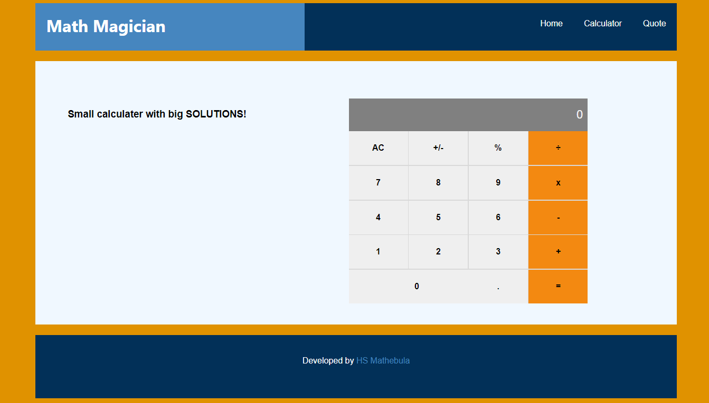

# Math Magicians

"Math magicians" is a website for all fans of mathematics. It is a Single Page App (SPA) that allows users to make simple calculations. Read a random math-related quote.

### demo netlify link : https://math-magicians-f0d448.netlify.app/
### demo herokuapp link : https://math-magitian.herokuapp.com/

## Built With
- HTML & CSS & JavaScript
- Html, Css & JavaScript linters
- React.Js

### Getting Started
- clone the repository by running\
    `git clone https://github.com/HSMathebula/main-magicians.git`
- navigate to the folder\
    `cd math-magicians`
- Install packages\
    `npm install`
- Run the app\
    `npm start`
- Eject the app\
    `npm run eject`
- Create build app\
    `npm run build`
- Test Linters app\
    `npm run check-linters`

## Authors

👤 **Happen Mathenula**

- GitHub: [@HSMathebula](https://github.com/HSMathebula)
- Twitter: [@HappenSipho](https://twitter.com/HappenSipho)
- LinkedIn: [LinkedIn](https://www.linkedin.com/in/happen-sipho-mathebula-4b0438115/)

## 🤝 Contributing

Contributions, issues, and feature requests are welcome!

Feel free to check the [issues page](https://github.com/HSMathebula/main-magicians/issues).

## Show your support

Give a ⭐️ if you like this project!

## 📝 License

This project is [MIT](./license.md) licensed.